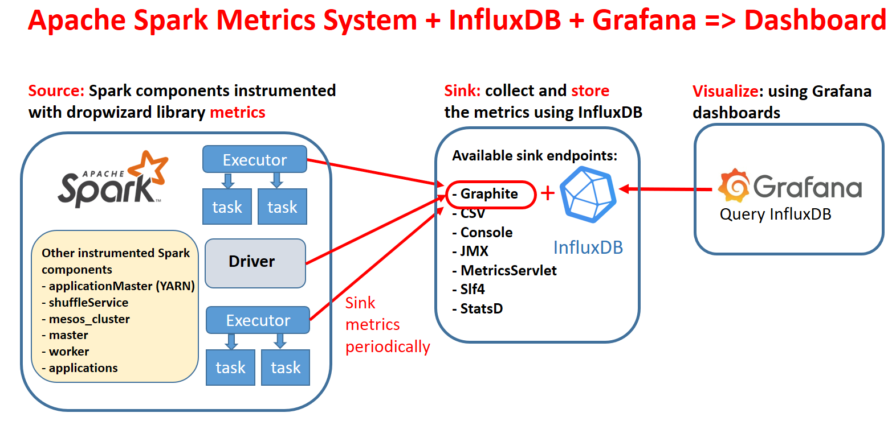

## Build an Online Performance Dashboard for Apache Spark

This note outlines the main steps in building a performance dashboard for Apache Spark
using InfluxDB and Grafana. The dashboard is useful for performance troubleshooting and
online monitoring. 

### Step 1: Understand the architecture


Spark is instrumented with the [Dropwizard/Codahale metrics library](https://metrics.dropwizard.io).
Several components of Spark are instrumented with metrics, see also the 
[spark monitoring guide](https://spark.apache.org/docs/latest/monitoring.html#metrics), 
notably the driver and executors components are instrumented with multiple metrics each.
In addition, Spark provides various sink solutions for the metrics. 
This work makes use of the Spark graphite sink and utilizes InfluxDB with a graphite 
endpoint to collect the metrics. Finally, Grafana is used for querying InfluxDB and 
plotting the graphs (see architectural diagram below).
An important architectural detail of the metrics system is that the metrics are sent directly
from the sources to the sink. This is important when running in distributed mode.
Each Spark executor, for example, will sink directly the metrics to InfluxDB.
By contrast, the WebUI/Eventlog instrumentation of Spark uses the Spark Listener Bus and metrics
flow through the driver in that case 
([see this link](https://raw.githubusercontent.com/LucaCanali/sparkMeasure/master/docs/sparkMeasure_architecture_diagram.png)
for further details).
The number of metrics instrumenting Spark components is quite large. 
You can find a [list at this link](Spark_dropwizard_metrics_info.md)


### Step 2: Install and configure InfluxDB
- Download and install InfluxDB from https://www.influxdata.com
  - Note: tested in Feb 2019 with InfluxDB version 1.7.3
- Edit the config file `/etc/influxdb/influxdb.conf` and enable the graphite endpoint
- **Key step:** Setup the templates configuration
  - The configuration used for this work is provided at: [influxDB graphite endpoint configuration snippet](influxdb.conf_GRAPHITE)  
  - This instructs InfluxDB on how to map data received on the graphite endpoint to the measurements and tags in the DB
- Optionally configure other influxDB parameters of interest as data location and retention
- Start/restart influxDB service: systemctl restart influxdb.service

###  Step 3: Configure Grafana and prepare/import the dashboard
- Download and install Grafana 
  - download rpm from https://grafana.com/ and start Grafana service: `systemctl start grafana-server.service`
  - Note: tested in Feb 2019 using Grafana 6.0.0 beta.
- Alternative: run Grafana on a Docker container: http://docs.grafana.org/installation/docker/
- Connect to the Grafana web interface as admin and configure
  - By default: http://yourGrafanaMachine:3000
  - Create a data source to connect to InfluxDB. 
    - Set the http URL with the correct port number, default: http://yourInfluxdbMachine:8086
    - Set the influxDB database name: default is graphite (no password)
  - **Key step:** Prepare the dashboard. 
    - To get started import the [example Grafana dashboard](Spark_Dashboard/Spark_Perf_Dashboard_v01_20190211.json)
    - You can also experiment with building your dashboard or augmenting the example.

### Step 4: Prepare Spark configuration to sink metrics to graphite endpoint in InfluxDB
There are a few alternative ways on how to do this, depending on your environment and preferences.
One way is to set a list of configuration parameters of the type `spark.metrics.conf.xx`
another is editing the file `$SPARK_CONF_DIR/metrics.properties`
Configuration for the metrics sink need to be provided to all the components being traced
(each component will connect directly to the sink).
See details at [Spark_metrics_config_options](Spark_metrics_config_options.md)
Example:  
  ```
  spark-submit/spark-shell/pyspark
  --conf "spark.metrics.conf.*.sink.graphite.class"="org.apache.spark.metrics.sink.GraphiteSink" \
  --conf "spark.metrics.conf.*.sink.graphite.host"="graphiteEndPoint_influxDB_hostName>" \
  --conf "spark.metrics.conf.*.sink.graphite.port"=<graphite_listening_port> \
  --conf "spark.metrics.conf.*.sink.graphite.period"=10 \
  --conf "spark.metrics.conf.*.sink.graphite.unit"=seconds \
  --conf "spark.metrics.conf.*.sink.graphite.prefix"="lucatest" \
  --conf "spark.metrics.conf.*.source.jvm.class"="org.apache.spark.metrics.source.JvmSource"
  ```

### Step 5: Start using the dashboard
- Run Spark workload, for example run Spark shell (with the configuration parameters of Step 3)
  - An example of workload to see some values populated in the dashboard is to run a query as: 
`spark.time(sql("select count(*) from range(10000) cross join range(1000) cross join range(100)").show)`
  - Another example is to run TPCDS benchmark, see https://github.com/databricks/spark-sql-perf

The configuration is finished, now you can test the dashboard.
Run Spark using the configuration as in Step 4 and start a test workload.
Open the web page of the Grafana dashboard:

- A drop-down list should appear on top left of the dashboard page, select the application you want to monitor. 
Metrics related to the selected application should start being populated as time and workload progresses.
- If you use the dashboard to measure a workload that has already been running for some time,
note to set the Grafana time range selector (top right of the dashboard) to a suitable time window
- For best results test this using Spark 2.4.0 or higher
(note Spark 2.3.x will also work, but it will not populate executor JVM CPU)
- Avoid local mode and use Spark with a cluster manager (for example YARN or Kubernetes) when
testing this. Most of the interesting metrics are in the executor source, which is not populated 
in local mode (up to Spark 2.4.0 included). 
- If you want to "kick the tires" of the dashboard, 
I can recommend running the [Spark TPCDS benchmark](https://github.com/databricks/spark-sql-perf)
as workload to monitor. 

### Example Graphs

The next step is to understand the metrics and how they can help you troubleshoot your application
performance. The (available metrics are many)[Spark_dropwizard_metrics_info.md], while
the  [example Grafana dashboard](Spark_Dashboard/Spark_Perf_Dashboard_v01_20190211.json)
provides only a small selection.
Here a few representative graphs.

- GRAPH: NUMBER ACTIVE TASKS  
  
One key metric is the graph of the number of active sessions as a function of time.
This shows how Spark is able to make use of the available cores allocated by the executors.

- GRAPH: JVM CPU USAGE
  
CPU used by the executors is another key metric to understand the workload.
The dashboard also reports the CPU consumed by tasks, the difference is that the
CPU consumed by the JVM includes for example of the CPU used by Garbage collection and more.

- GRAPH: JVMMEMORY USAGE
  
Memory is another important aspect of Spark workload (think of the many cases of OOM errors).
Various graphs in the dashboard can help you understand memory usage and Garbage collection activity.

- GRAPH: [HDFS BYTES READ](GRAPH_HDFS_bytes_read.PNG)

- GRAPH [SPARK JOB TIME COMPONENTS](GRAPH_Time_components.PNG)

- **Dashboard view**
  - Part1 [Summary metrics](dashboard_part1_summary.PNG)
  - Part2 [Workload metrics](dashboard_part2_workload.PNG)
  - Part3 [Memory metrics](dashboard_part3_memory.PNG)
  - Part4 [I/O metrics](dashboard_part4_IO.PNG)  
